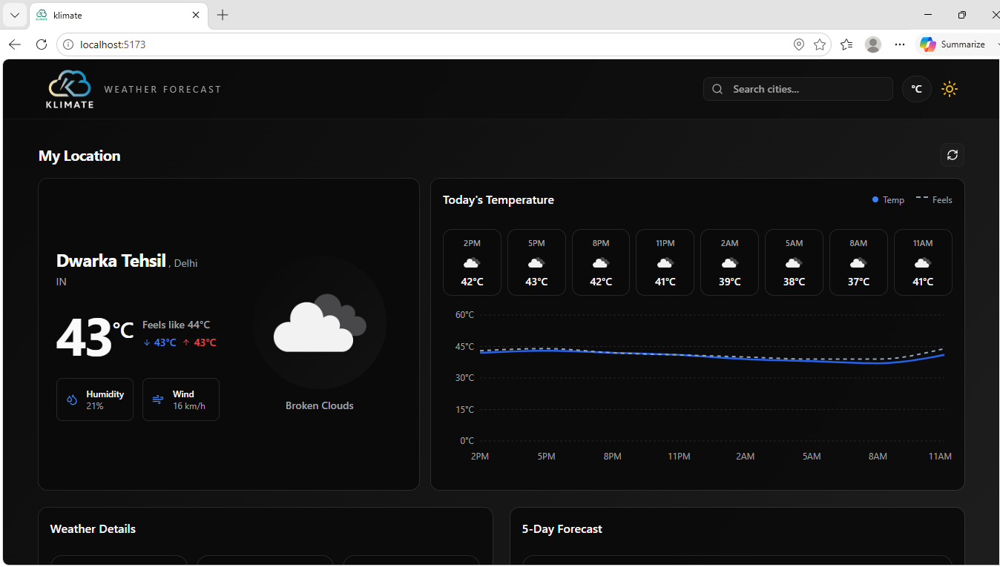
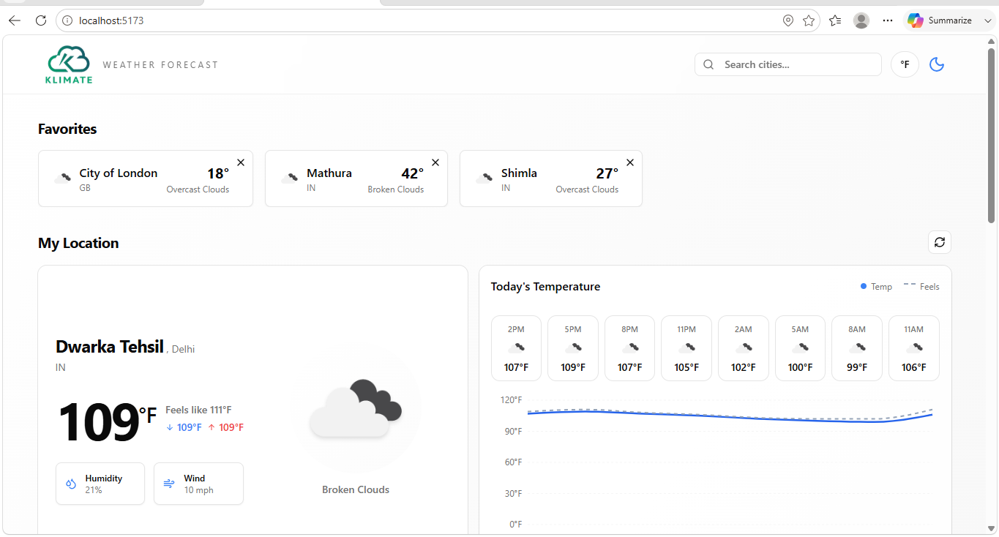
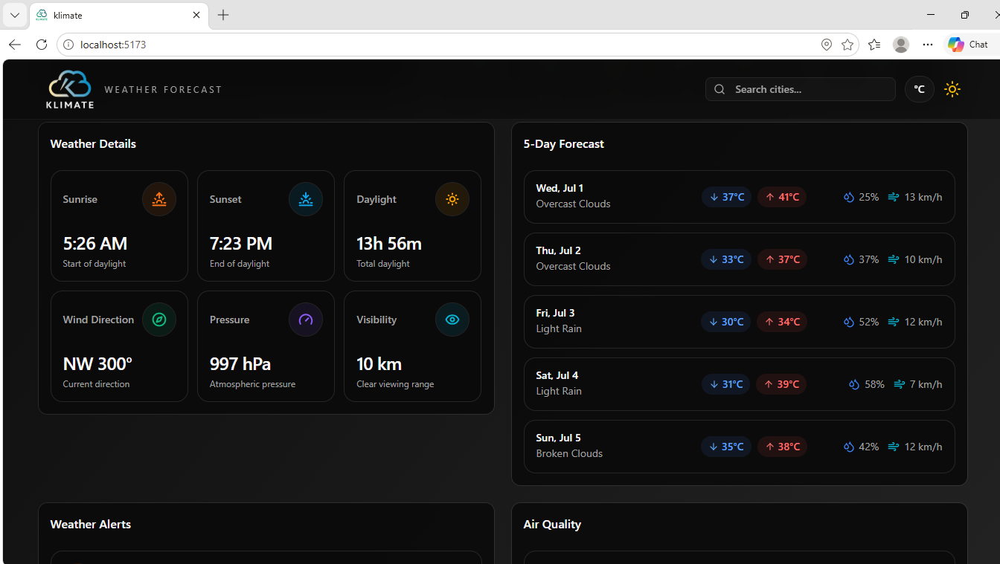
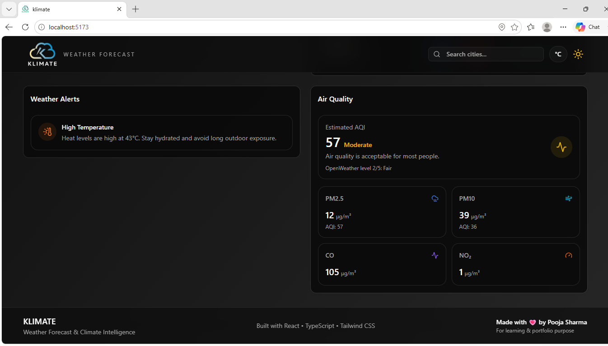

# 🌦️ KLIMATE – Smart Weather Forecast Application

KLIMATE is a smart and responsive weather forecasting application built using **React, TypeScript, Tailwind CSS, and OpenWeather API**. It provides real-time weather updates, air quality monitoring, weather alerts, geolocation-based forecasts, and detailed weather analytics through a clean and modern user interface.

---

## ✨ Features

### 📍 Current Location Weather

* Detects the user's current location using the Geolocation API.
* Displays real-time weather information based on the user's coordinates.

### 🔍 Smart City Search

* Search weather information for cities around the world.
* Shows city, state, and country information for better accuracy.

### 🌡️ Real-Time Weather Data

* Current temperature
* Feels-like temperature
* Minimum and maximum temperatures
* Weather conditions and descriptions
* Weather icons

### 📊 Hourly Forecast

* Interactive hourly temperature visualization.
* Displays upcoming temperature trends throughout the day.

### 📅 5-Day Weather Forecast

* Multi-day forecast with weather conditions and temperatures.
* Easy-to-read forecast cards.

### 🌬️ Detailed Weather Information

* Humidity
* Wind speed and direction
* Pressure
* Visibility
* Sunrise and sunset timings

### 🚨 Weather Alerts

* Displays weather warnings and severe weather conditions.
* Helps users stay informed about changing weather conditions.

### 🌫️ Air Quality Monitoring

* Real-time Air Quality Index (AQI)
* Pollutant information including:

  * PM2.5
  * PM10
  * Ozone
  * Carbon Monoxide
  * Nitrogen Dioxide

### ⭐ Favorite Cities

* Save frequently searched cities.
* Quick access to weather information.

### 🌗 Dark & Light Theme

* Seamless theme switching.
* Optimized UI for both light and dark modes.

### 🌡️ Unit Conversion

* Switch between Celsius and Fahrenheit.
* Dynamic wind speed conversion.

### 📱 Responsive Design

* Optimized for desktop, tablet, and mobile devices.
* Modern and adaptive interface.

---

## 🛠️ Technologies Used

| Technology      | Purpose                          |
| --------------- | -------------------------------- |
| React           | User Interface Development       |
| TypeScript      | Type Safety and Scalability      |
| Tailwind CSS    | Responsive Styling               |
| Vite            | Fast Development Environment     |
| OpenWeather API | Weather Data                     |
| React Query     | Data Fetching and Caching        |
| React Router    | Client-side Routing              |
| Recharts        | Weather Charts and Visualization |
| Lucide React    | Icons                            |
| Geolocation API | User Location Detection          |

---

## ⚙️ Application Workflow

### 1️⃣ Location Detection or City Search

The application either:

* Detects the user's current location, or
* Accepts a searched city.

### 2️⃣ API Data Retrieval

Weather and forecast information is fetched from OpenWeather APIs.

### 3️⃣ Data Processing

The application processes:

* Current weather
* Forecast data
* Air quality data
* Weather alerts

### 4️⃣ Dynamic UI Rendering

The information is displayed through:

* Weather cards
* Charts
* Forecast components
* Alert panels
* AQI indicators

### 5️⃣ User Interaction

Users can:

* Search cities
* Save favorites
* Switch units
* Change themes
* Refresh weather data

---

## 📸 Application Preview

### 🌙 Dark Theme

  

---

### ☀️ Light Theme

  

---

### 🌤️ Weather Details

  

---

### 🌫️ Air Quality

  

